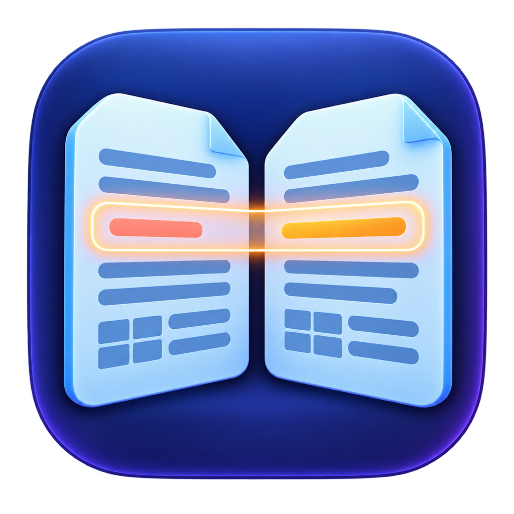

# ClariDiff · 明析

简体中文 · [English](README.md)

> 比较一切，只看真正重要的变化。



ClariDiff 是一个面向 macOS 的开源、本地优先比较工具。它能理解结构化数据，避免代码插入导致整页错位，并按有意义的内容块比较文档。所有文件都留在你的 Mac 上：无需账号、没有分析统计、没有云服务，也不会上传数据。

**完全本地 · 开源 · 数据、代码与文档 · 中文与 English**

[下载 1.0.0](https://github.com/qingtan-labs/ClariDiff/releases/latest) · [报告问题](https://github.com/qingtan-labs/ClariDiff/issues)

## 下载

| 版本 | 系统 | 架构 | 下载 |
|---|---|---|---|
| 1.0.0 | macOS 13 Ventura 或更高版本 | Apple 芯片 + Intel（Universal 2） | [ClariDiff-1.0.0-Universal.dmg](https://github.com/qingtan-labs/ClariDiff/releases/download/v1.0.0/ClariDiff-1.0.0-Universal.dmg) |

独立 Universal 2 CLI 和 `SHA256SUMS` 可以在 [Releases 页面](https://github.com/qingtan-labs/ClariDiff/releases/latest)下载。

> **签名状态：**1.0.0 使用 ad-hoc 签名，尚未经过 Apple 公证。首次运行时，请在“应用程序”中按住 Control 点击 ClariDiff，然后选择**打开**。不要关闭 Gatekeeper。详见[安全安装说明](docs/INSTALL.zh-Hans.md)。

## 支持的比较类型

| 类别 | 格式 | 比较方式 |
|---|---|---|
| 结构化数据 | JSON、JSONL/NDJSON、YAML、TOML、XML、CSV | 忽略对象顺序、数组主键/无序比较、忽略路径、数字误差、字符串归一化 |
| 前端源码 | Vue、React JSX/TSX、JavaScript/TypeScript、Svelte、Astro、MDX、HTML、CSS/Sass/Less/Stylus/PostCSS、GraphQL | 有序内容块对齐，插入内容不会让后续所有行错位 |
| 其他源码 | Swift、Python、Java、Kotlin、Go、Rust、C/C++、C#、Ruby、PHP、Shell、SQL 等 | 有序内容块对齐并归一化空白 |
| 文档 | TXT、Markdown、RTF、DOCX、带文字层的 PDF | 按标题、段落、列表项、表格行与文本块比较 |
| 兜底 | 任意可解码的文本文件 | 有序文本块比较 |

1.0.0 暂不支持扫描 PDF、加密文档、图片 Diff 和视觉排版比较。

1.0.0 的源码比较是文件级、按格式识别的内容块对齐，还不是语言 AST 级语义比较。它暂不会把 import 换序或等价重构视为相同，也不比较整个文件夹或依赖图。

## 主要能力

- 原生 SwiftUI 三栏工作区，支持粘贴、剪贴板、选择文件和拖放。
- 自动识别格式，并在对应输入区显示语法错误。
- 对 JSON、JSONL、YAML、TOML、XML、CSV 进行结构比较，而不是逐行制造噪声。
- 数组支持按位置、忽略顺序、按 `id` 等字段匹配。
- 忽略路径支持 `*` 通配符。
- 支持绝对误差和相对百分比误差。
- 支持空格、大小写、日期、换行和数字字符串归一化。
- 使用 LCS 序列引擎对齐代码和文档内容块。
- 可筛选新增、删除、修改和类型变化，并搜索路径。
- 导出 Markdown 报告，提供独立 `claridiff` CLI。
- 中英文界面。
- 无分析统计、无账号、无网络请求、无数据上传。

## 快速开始

1. 下载并打开 DMG。
2. 将 ClariDiff 拖入“应用程序”。
3. 首次运行时，按住 Control 点击 ClariDiff 并选择“打开”。
4. 拖入或粘贴两份需要比较的内容。
5. 在需要忽略顺序、动态字段或数值误差时调整规则。

## CLI

```bash
chmod +x claridiff-1.0.0-macos-universal
sudo install claridiff-1.0.0-macos-universal /usr/local/bin/claridiff
claridiff before.yaml after.yaml
```

忽略动态路径：

```bash
claridiff old.json new.json \
  --ignore /updatedAt \
  --ignore /requestId
```

数组按 `id` 匹配：

```bash
claridiff old.yaml new.yaml --array-key /users=id
```

导出 Markdown 报告：

```bash
claridiff expected.docx actual.docx \
  --config .claridiff.yml \
  --format markdown \
  --output diff-report.md
```

退出码：`0` 表示没有实质差异，`1` 表示存在差异，`2` 表示文件或配置错误。

## 从源码构建

需要 macOS 13 或更高版本，以及包含 macOS SDK 的完整 Xcode。

```bash
git clone https://github.com/qingtan-labs/ClariDiff.git
cd ClariDiff
swift test
make app
open dist/ClariDiff.app
```

生成 Universal 2 DMG 与 CLI：

```bash
make release
```

## 隐私与开源

ClariDiff 完全在本地执行比较，不会传输文件内容。向公开 Issue 添加样本前，请先移除敏感信息。详见[隐私说明](PRIVACY.md)和[安全策略](SECURITY.md)。

欢迎提交 Issue 和 Pull Request。ClariDiff 使用 [MIT License](LICENSE) 开源。
